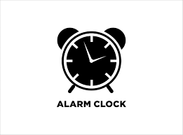

# Alarm Clock Web App ⏰

A simple, elegant alarm clock built with HTML, CSS, and vanilla JavaScript.

## 🔍 Overview

This project displays a digital clock that updates in real time and allows users to set an alarm for a specific time (hour and minute). When the alarm time is reached, a ringtone plays until the user clears it.

## 🧰 Technologies Used

- HTML5
- CSS3
- JavaScript (ES6)

## 📂 Project Structure

📁 your-project-folder/
├── index.html
├── style.css
├── app.js
├── files/
│ ├── images.png # Clock image
│ └── ringtone # Audio file (e.g. ringtone.mp3)


## 🚀 Features

- Live digital clock
- Selectable hour and minute dropdowns
- Alarm set & clear functionality
- Custom ringtone playback
- Responsive design

## 📸 UI Preview



## 🛠️ How to Use

1. Clone the repository or download the files.
2. Make sure you have a ringtone audio file inside the `files` folder.
3. Open `index.html` in your browser.
4. Select the desired alarm time.
5. Click **Set Alarm**.
6. When the time matches, the alarm will ring.
7. Click **Clear Alarm** to stop the ringtone and reset.

## ⚠️ Notes

- Make sure the file path to `ringtone` is correct. If your ringtone is an `.mp3`, rename it like `ringtone.mp3` and update the JavaScript line:
  ```js
  const ringtone = new Audio("./files/ringtone.mp3");
